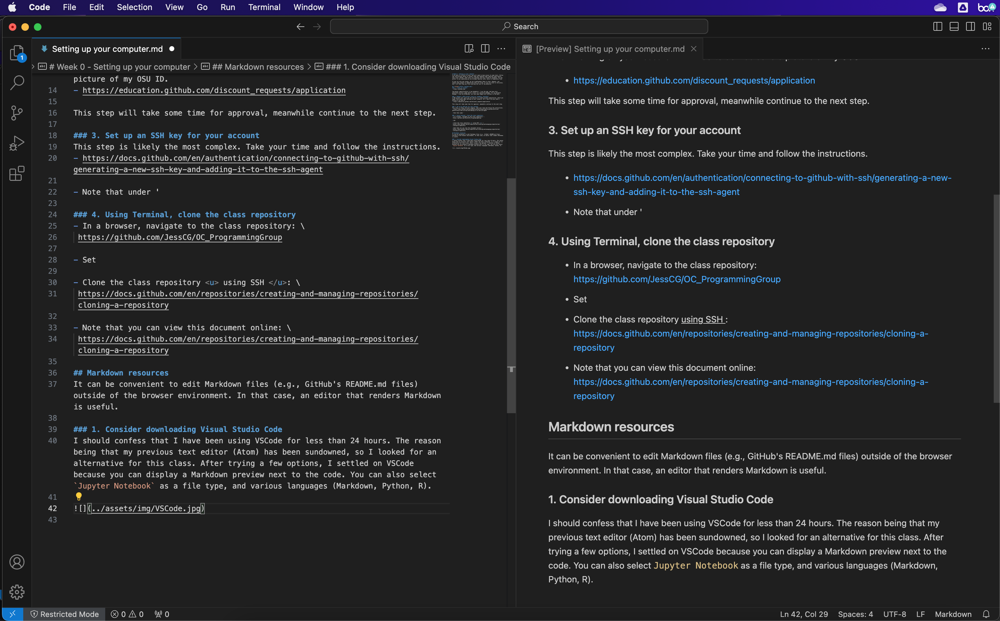

# Week 0 - Setting up your computer
To be able to follow in class, you will need to have access to some tools. Follow the instructions below to install them and complete some required steps before next class (10/04). Some tools are optional and only listed as guidance. You may prefer to use something you are already familiar with, which is completely fine.

If you run into any issues, we can troubleshoot them in class. However, you should come prepare to demonstrate what you tried. If you are stuck in one place, don't let that stop you from covering the rest of the material.

## [GitHub](https://github.com/)
### 1. Create an account 
- https://github.com/

Two-factor identification is now mandatory. I use the app, and have also generated recovery codes which I store in a password manager. For my password manager, I now use BitWarden, but have been happy with LastPass in the past.

### 2. Request a PRO account (free for students; optional)
A PRO account will give you the ability to create private repositories, which you might find useful when working on your research. All I had to do was send a picture of my OSU ID.
- https://education.github.com/discount_requests/application

This step will take some time for approval, meanwhile continue to the next step.

### 3. Set up an SSH key for your account
This step is likely the most complex. Take your time and follow the instructions. 
- https://docs.github.com/en/authentication/connecting-to-github-with-ssh/generating-a-new-ssh-key-and-adding-it-to-the-ssh-agent

- Note that in the section `Adding your SSH key to the ssh-agent` (bullet 3), I do not use the option `--apple-use-keychain` but still set a passphrase, which I store in my password manager. I simply use:

```
ssh-add ~/.ssh/id_ed25519
```

### 4. Using Terminal, clone the class repository
- In a browser, navigate to the class repository: \
 https://github.com/JessCG/OC_ProgrammingGroup

- Clone the class repository <u> using SSH </u>: \
 https://docs.github.com/en/repositories/creating-and-managing-repositories/cloning-a-repository

- Note that you can view this document online: \
 https://docs.github.com/en/repositories/creating-and-managing-repositories/cloning-a-repository

## Markdown resources
It can be convenient to edit Markdown files (e.g., GitHub's README.md files) outside of the browser environment. In that case, an editor that renders Markdown is useful.

### 1. Consider downloading Visual Studio Code
I should confess that I have been using VSCode for less than 24 hours. The reason being that my previous text editor (Atom) has been sundowned, so I looked for an alternative for this class. After trying a few options, I settled on VSCode because you can display a Markdown preview next to the code. You can also select `Jupyter Notebook` as a file type, and various languages (Markdown, Python, R).

- To show the code and Markdown preview side-by-side, select `Markdown: Toggle Preview Locking` in your **Command Palette** (⇧⌘P)



### 2. Markdown basic syntax
- https://www.markdownguide.org/basic-syntax/