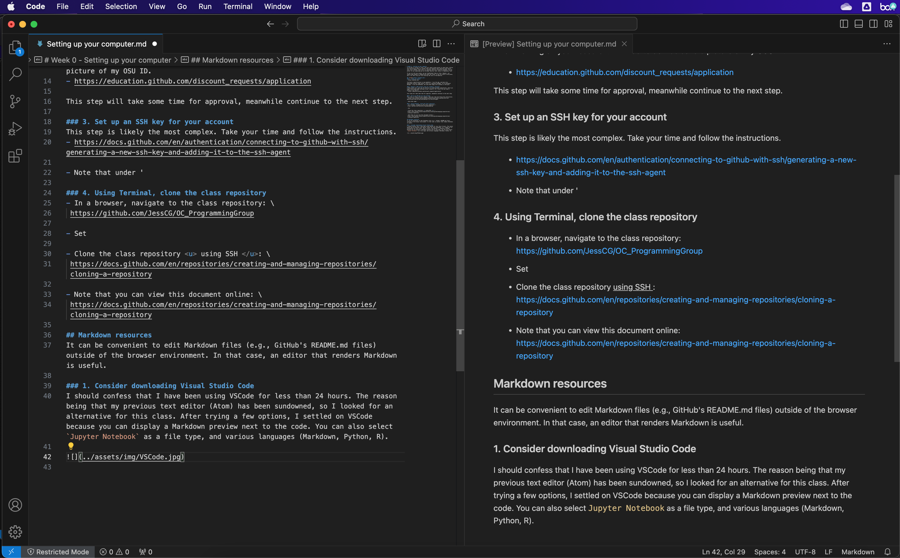

# Week 0 - Setting up your computer
To be able to follow in class, you will need to have access to some tools. Follow the instructions below to install the tools required for next class (10/04). Some tools are optional and only listed as guidance; it is completely fine if prefer to use something you are already familiar with.

If you run into any issues, we can troubleshoot them in class. However, you should come prepare to demonstrate what you tried. If you are stuck in one place, don't let that stop you from covering the rest of the material.

You can also view this document [online](https://github.com/JessCG/OC_ProgrammingGroup/blob/main/Assignments/Setting%20up%20your%20computer.md).

## Terminal
### 1. Ensure that your laptop has a Terminal
- **Mac OS**: Apple computers come with a Terminal app already installed. I prefer to use [iTerm2](https://iterm2.com/) in part because I can customize profiles to indicate which server or computer I am accessing remotely. I can also sync these profiles across computers. 
- **Windows**: you will need to download a terminal app. Many use [PuTTY](https://www.putty.org/)
- **Linux**: I trust you already have your favorite terminal emulator

### 2. Note for Windows users
Terminal commands on Mac/Linux will not match those on Windows. I only know UNIX commands, so Windows user may want to refer to this [cheat sheet](https://ftp.kh.edu.tw/Linux/Redhat/en_6.2/doc/gsg/ch-doslinux.htm). Terminal commands will be a minor part of the class, but if you are a Windows user and would prefer to be able to follow along with the same terminal commands as me, <u> please email me</u> and we can ask about getting you an account on the CEOAS' Jupyter server for the duration of the class.


## [GitHub](https://github.com/)
### 1. Create a GitHub account 
Sign up at: \
https://github.com/

Two-factor identification is now mandatory. I use the app, and have also generated recovery codes which I store in a password manager. For my password manager, I now use [BitWarden](https://bitwarden.com/), but have been happy with [LastPass](https://www.lastpass.com/) in the past.

### 2. Request a PRO account (free for students; optional)
A PRO account will give you the ability to create private repositories, which you might find useful when working on your research. All I had to do was send a picture of my OSU ID.
- https://education.github.com/discount_requests/application

This step will take some time for approval, meanwhile continue to the next step.

### 3. Set up an SSH key for your account
This step is likely the most complex. Take your time and follow the instructions at the link below. In short, you need to generate an SSH key which will generate both a public and private key, and a passphrase for encryption. The private key remains on your computer, while the public key is saved in your GitHub account. This allows GitHub to recognize your computer as an authorized access. You should generate a new private/public key pair for each new computer or server you connect to your GitHub account in case one is compromised. It is also easier to remove access from specific computers or servers that way. 

Never share your private key! I save all of the key information in a secure note in my password manager. 

The instructions:
- https://docs.github.com/en/authentication/connecting-to-github-with-ssh/generating-a-new-ssh-key-and-adding-it-to-the-ssh-agent

- Note that in the section `Adding your SSH key to the ssh-agent` (bullet 3), I do not use the option `--apple-use-keychain` but still set a passphrase, which I store in my password manager. I simply use:

    ```
    $ ssh-add ~/.ssh/id_ed25519
    ```

### 4. Using Terminal, clone the class repository
- In a browser, navigate to the class repository: \
 https://github.com/JessCG/OC_ProgrammingGroup

- On your laptop, open your Terminal and navigate to the folder where you want to clone the class repository

- Clone the class repository <u> using SSH</u>, following the instructions: \
 https://docs.github.com/en/repositories/creating-and-managing-repositories/cloning-a-repository

- You should now be able to view all of the files for the class on your laptop. It may be useful to download an editor that renders Markdown such as [Visual Studio Code](https://code.visualstudio.com/) (detailed below).

- To update your local repository, navigate to the `OC_ProgrammingGroup` repository and type:

    ```
    $ git pull
    ```

## Conda
### 1. Install conda
Install [Anaconda](https://docs.anaconda.com/free/anaconda/install/index.html) or [Miniconda](https://docs.conda.io/projects/miniconda/en/latest/miniconda-install.html). Miniconda is a minimal installer for conda that includes only conda and Python. I prefer it because I avoid installing the 100s of packages associated with Anaconda, and instead install just what I need. However, others like to use the Anaconda Navigator. I am sure it has its advantages; I just can't help with it.

### 2. Create a conda environment (optional)
One of the advantages of conda is that you can [create conda environments](https://conda.io/projects/conda/en/latest/user-guide/tasks/manage-environments.html#creating-an-environment-with-commands), which keeps modules for different projects separate, avoiding potential conflicts. It is also possible for people to recreate someone else's conda environment, ensuring reproducibility. I have an environment named `sandbox` for data exploration, classes, etc. It is completely fine if that environment breaks. (Hopefully not right before class.)

## Install Jupyter Lab and other Python modules
Once you have conda installed, open Terminal, activate the relevant conda environment (if applicable) and [install Jupyter Lab](https://jupyterlab.readthedocs.io/en/stable/getting_started/installation.html):

```
conda install -c conda-forge jupyterlab
```

Using the same command, you can install Python modules commonly used in oceanography: 
- `xarray`
- `cartopy`
- `numpy`
- `pandas`
- `scipy` 
- `matplotlib`

From now on, when you want to work on a project:
- In your terminal, activate the conda environment you created for the project
```
conda activate _nameoftheenvironment_
```
- Launch Jupyter Lab:
```
jupyter lab
```

## Markdown resources
It can be convenient to edit Markdown files (e.g., GitHub's README.md files) outside of the browser environment. In that case, an editor that renders Markdown is useful.

### 1. Consider downloading Visual Studio Code (optional)
I should confess that I have been using [VSCode](https://code.visualstudio.com/) for less than 24 hours. The reason being that my previous text editor (Atom) has been sundowned, so I looked for an alternative for this class. After trying a few options, I settled on VSCode because you can display a Markdown preview next to the code. You can also select `Jupyter Notebook` as a file type, and various languages (Markdown, Python, R).

- To show the code and Markdown preview side-by-side, select `Markdown: Toggle Preview Locking` in your **Command Palette** (⇧⌘P)



### 2. Markdown basic syntax
- https://www.markdownguide.org/basic-syntax/

